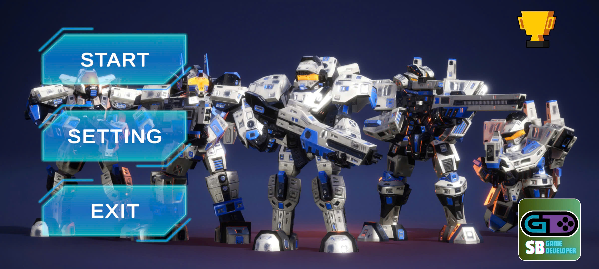
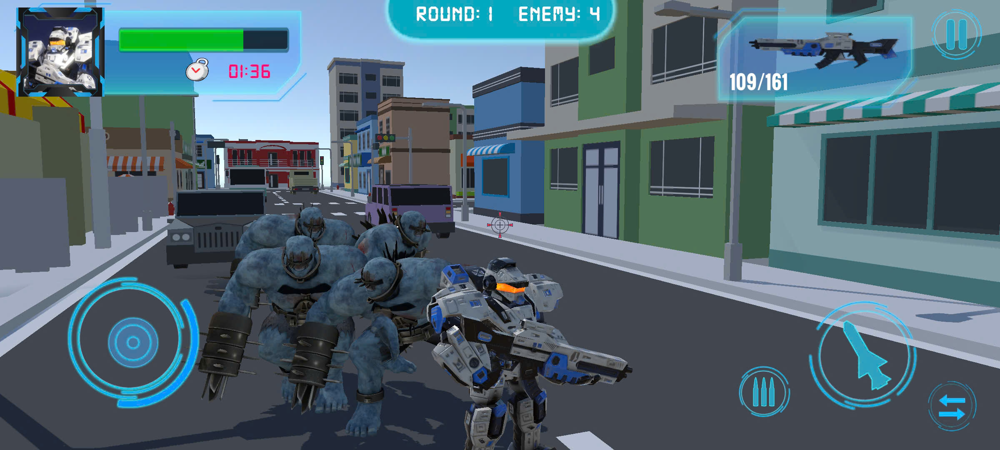
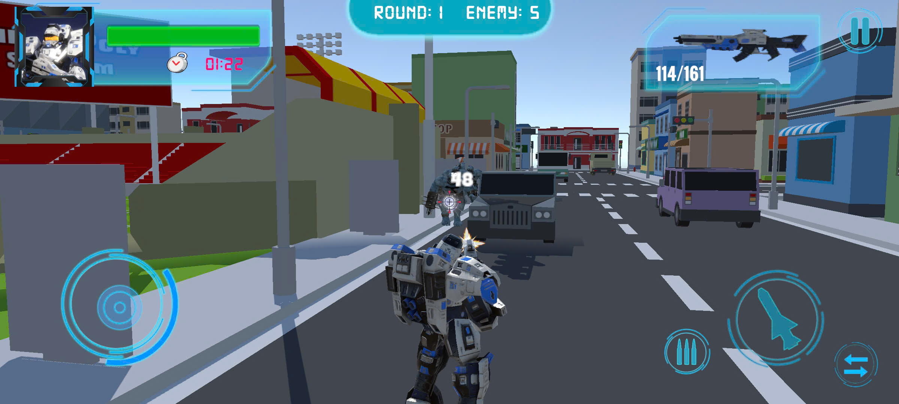
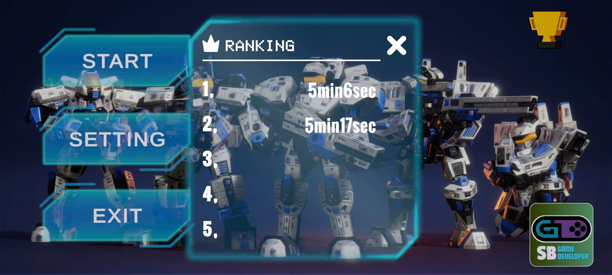

# 🎮 ZombieAI2D

🚀 Dự án tiếp theo trong quá trình tìm hiểu về ngành game, Em muốn thử sức với game 3D. ZombieAi là game bắn súng săn zombie góc nhìn thứ 3. Người chơi sẽ điều khiển nhân vật chiến đấu trong bản đồ thành phố. Zombie sẽ liên tục tìm đến vị trí của người chơi. Nhiệm vụ của người chơi là tiêu diệt chúng nhanh nhất. 

---
## 📖 Mô Tả

- **Thể loại**: 3D, TPS, Mobile
- **Công cụ**: Unity (phiên bản 2022.3.58f1), Visual Studio 2022, Adobe Photoshop  
- **Mục tiêu**: Hoàn thành trò chơi đầy đủ các tính năng chính như giao diện trang chủ, chức năng bắn súng, tính sát thương, tính năng tìm đường, reload, pause, ... Tối ưu hệ thống gameplay mượt mà, mâng lại trải nghiệm tốt cho người chơi. Phục vụ cho việc làm dự án cá nhân để giới thiệu kĩ năng của bản thân cũng nhữ các định hướng khác trong tương lai. 

---
## 🔧 Tính năng:

- ✔️ Hệ thống điều khiển đơn giản, phù hợp với nhiều đối tượng. 
  
- ✔️ Chức năng tính sát thương, chuyển trạng thái nhân vật, thay đạn, di chuyển, ... 

- ✔️ Sử dụng item bổ sung máu và đạn. 

- ✔️ Độ khó và số lượng quái phù hợp tăng dầng theo các round trong trận đấu. 

- ✔️ Hệ thống âm thanh sử dụng AutoMixer, chỉnh sửa trong cài đặt. 

- ✔️ Thiết kế mã nguồn theo nguyên tắc opp. 

- ✔️ Sử dụng LeanTwean cho việc animation các hiệu ứng Ui. 

- ✔️ Zombie tự động tìm đường bằng AINavigation.

- ✔️ Bảng xếp hạng theo thời gian hoàn thành trận đấu.

---

## 📸 Demo

  
  
  

  
  
  
  <i>📂 Link video demo chi tiết và apk: https://drive.google.com/drive/folders/10dGabLDZoxJTRm8hvexn-OLzQkhGuBQV?usp=drive_link </i>

---

## 🕹️ Yêu Cầu & Cài Đặt (Requirements & Setup)
1, Tải và cài đặt Unity 2022.3.58f1 LTS hoặc cao hơn

2, Clone dự án: git clone https://github.com/NguyennBinhh/ZombieAI.git

3, Mở dự án qua Unity Hub

4, Nhấn Play để chạy thử trong Editor

---

## 🛣️ Roadmap
✅ Cơ bản game bắn súng hoạt động

✅ Hệ thống âm thanh

✅ Tính toán sát thương

✅ Thay đạn, thay đổi trạng thái của người chơi

✅ Hoạt ảnh chết của người chơi và Zombie

✅ Hệ thống tự động tìm đường đến vị trí của người chơi

✅ Hệ thống xếp hạng theo thời gian hoàn thành

---

## 👥 Credits

Code, thiết kế và triển khai bởi Nguyễn Bá Bình.

